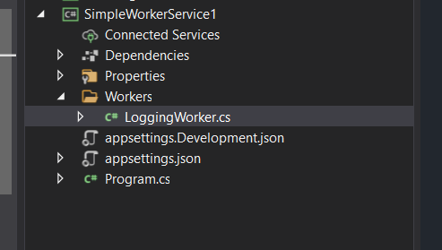

# Building a good architecture for the worker services solutions

---

> Worker Services architecures can be built based on the requirements.

---

## Termenologies

|Term| Definition|
|:------:|:---------|
|__Worker Services__ | .Net or .Net Core template for creating background long-running services as a cross-platform support <li> no longer restricted to Windows.<li> Hosted services are logging, configuration, and dependency injection (DI) ready.|
|__Windows Services__|.Net framework background service|
|||

## Basic Time Delay Architecture : 
- The simplest way to build the architure is to KISS (Keep It Simple Stubid) using the basic template of Microsoft by identifying business and other concerns at the worker class.
- The `ExecuteAsync()` must implement operations of the worker, contain all functionality of the service operations 

### Example

```{c#}
    public class LoggingWorker : BackgroundService
    {
        private readonly ILogger<LoggingWorker> _logger;

        public Worker(ILogger<LoggingWorker> logger)
        {
            _logger = logger;
        }
       
        protected override async Task ExecuteAsync(CancellationToken stoppingToken)
        {
            // Configurations and setups

            while (!stoppingToken.IsCancellationRequested)
            {
                // Operations running
                _logger.LogInformation("Worker running at: {time}", DateTimeOffset.Now);


                // Delay Concern
                await Task.Delay(1000, stoppingToken);
            }
        }
    }
}
```

- Then registering service as a hosted service.

```
    public class Program
    {
        public static void Main(string[] args)
        {
            CreateHostBuilder(args).Build().Run();
        }

        public static IHostBuilder CreateHostBuilder(string[] args) =>
            Host.CreateDefaultBuilder(args)
                .ConfigureServices((hostContext, services) =>
                {
              
                    services.AddHostedService<LoggingWorker>();
                });
    }
```
- I think the Microsoft Template already implement that as basic architecture, so the next step is to organize the project folders only like:



- The fact of creating this architecture is to keep the project simple enough to understand and develop, but based on many reasons like piplining and scheduling concens and events
---

## Queuing Worker Services Architecture


