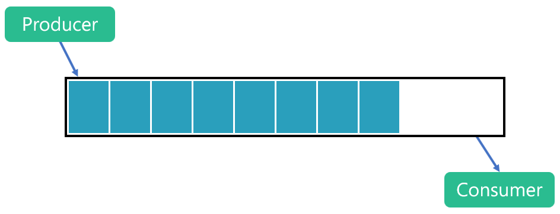

# C# Channels `System.Threading.Channnels`


> A channel is a synchronisation concept which supports passing data between producers and consumers, typically concurrently. One or many producers can write data into the channel, which are then read by one or many consumers.

> Released in May 2018

> Have one or more producers and one or more consumers

> Logically a channel is effectively an efficient, thread-safe queue.

> Channels can be used by .NET implementations supporting .NET Standard 1.3 and higher



- Steve Says that the primary usage of channels had been within queue processing worker service.

## Why We Use Channels

- Thread Safe Data Transfer
- Using Channels to transfer data between Hosted and Worker services or the Same type of Services 
- Improve Response Time


## Creating a channel


> To create a channel, we can use the static Channel class which exposes factory methods to create the two main types of channel.

- There are 2 types of channels provided by factory methods
  - Channels with Unlimited capacity `CreateUnbounded<T>`
  - Channels with limited capacity `CreateBounded<T>`

```
var channel = Channel.CreateUnbounded<string>();
```

- The channel has two properties. Reader returns a `ChannelReader<T>` and the writer, a `ChannelWriter<T>` .


### Writing to a channel

- Asynchrounus Way
```
await channel.Writer.WriteAsync("New message");
```
- Synch Way

```
bool result = channel.Writer.TryWrite("New message");
```

### Reading from a channel

- This code uses a while loop to keep a constant consumer running. In the final sample, you will see that the producer(s) and consumer(s) start concurrently.


```

while (await _reader.WaitToReadAsync())
{
    if (_reader.TryRead(out var msg))
    {                    
        Console.WriteLine(msg);
    }
}
```
  
## Sample Implementation 
Steve implement 3 functions that simply expose knowlege of channels, With One Channel and (one or many producers and consumers).


### SINGLE PRODUCER / SINGLE CONSUMER

```
public static async Task SingleProducerSingleConsumer()
{
    var channel = Channel.CreateUnbounded<string>();

    // In this example, the consumer keeps up with the producer

    var producer1 = new Producer(channel.Writer, 1, 2000);
    var consumer1 = new Consumer(channel.Reader, 1, 1500);

    Task consumerTask1 = consumer1.ConsumeData(); // begin consuming
    Task producerTask1 = producer1.BeginProducing(); // begin producing

    await producerTask1.ContinueWith(_ => channel.Writer.Complete());

    await consumerTask1;
}

```
### MULTI PRODUCER / SINGLE CONSUMER

```
public static async Task MultiProducerSingleConsumer()
{
    var channel = Channel.CreateUnbounded<string>();

    // In this example, a single consumer easily keeps up with two producers

    var producer1 = new Producer(channel.Writer, 1, 2000);
    var producer2 = new Producer(channel.Writer, 2, 2000);
    var consumer1 = new Consumer(channel.Reader, 1, 250);

    Task consumerTask1 = consumer1.ConsumeData(); // begin consuming

    Task producerTask1 = producer1.BeginProducing();

    await Task.Delay(500); // stagger the producers

    Task producerTask2 = producer2.BeginProducing();

    await Task.WhenAll(producerTask1, producerTask2)
        .ContinueWith(_ => channel.Writer.Complete());

    await consumerTask1;
}
```

### SINGLE PRODUCER / MULTI CONSUMER

```
public static async Task SingleProduceMultipleConsumers()
{
    var channel = Channel.CreateUnbounded<string>();

    // In this example, multiple consumers are needed to keep up with a fast producer

    var producer1 = new Producer(channel.Writer, 1, 100);
    var consumer1 = new Consumer(channel.Reader, 1, 1500);
    var consumer2 = new Consumer(channel.Reader, 2, 1500);
    var consumer3 = new Consumer(channel.Reader, 3, 1500);

    Task consumerTask1 = consumer1.ConsumeData(); // begin consuming
    Task consumerTask2 = consumer2.ConsumeData(); // begin consuming
    Task consumerTask3 = consumer3.ConsumeData(); // begin consuming

    Task producerTask1 = producer1.BeginProducing();

    await producerTask1.ContinueWith(_ => channel.Writer.Complete());

    await Task.WhenAll(consumerTask1, consumerTask2, consumerTask3);
}
```

## Resources
- Steve Gordon (Microsoft MVP)  [AN INTRODUCTION TO SYSTEM.THREADING.CHANNELS](https://www.stevejgordon.co.uk/an-introduction-to-system-threading-channels) 20th August 2019
- 

